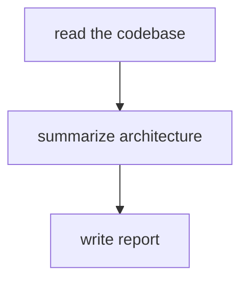
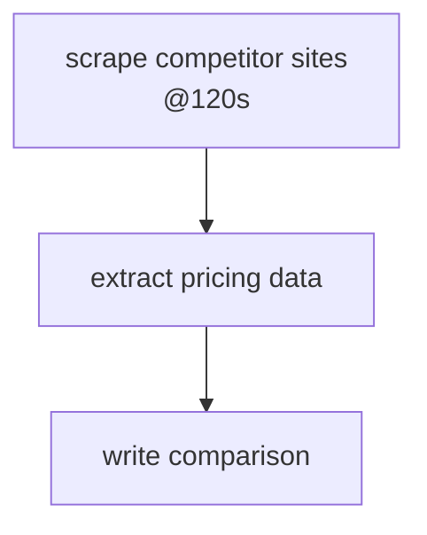
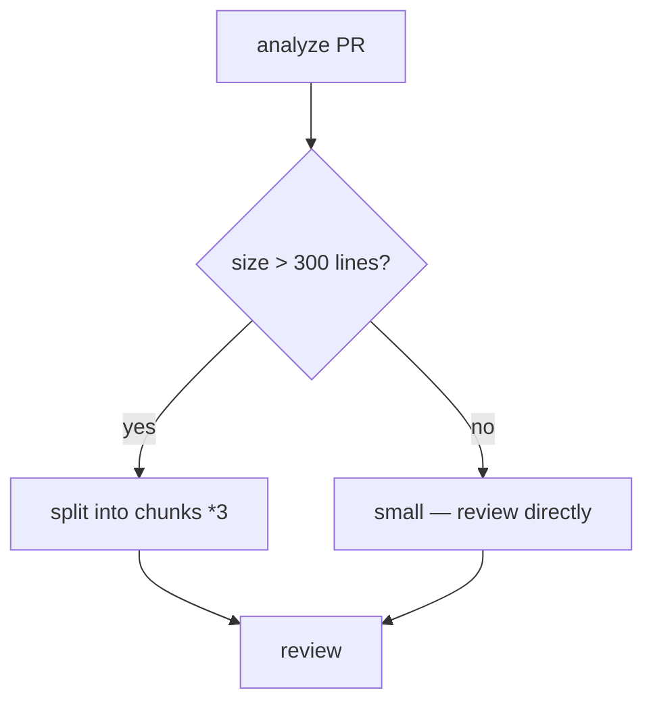
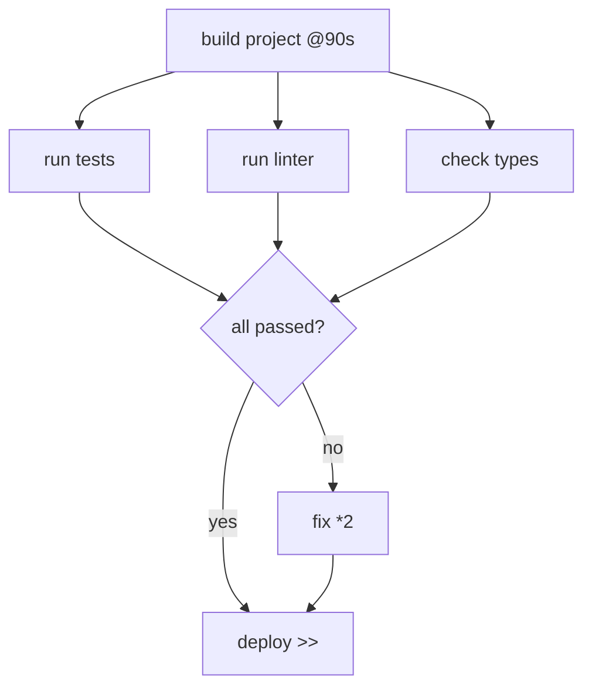
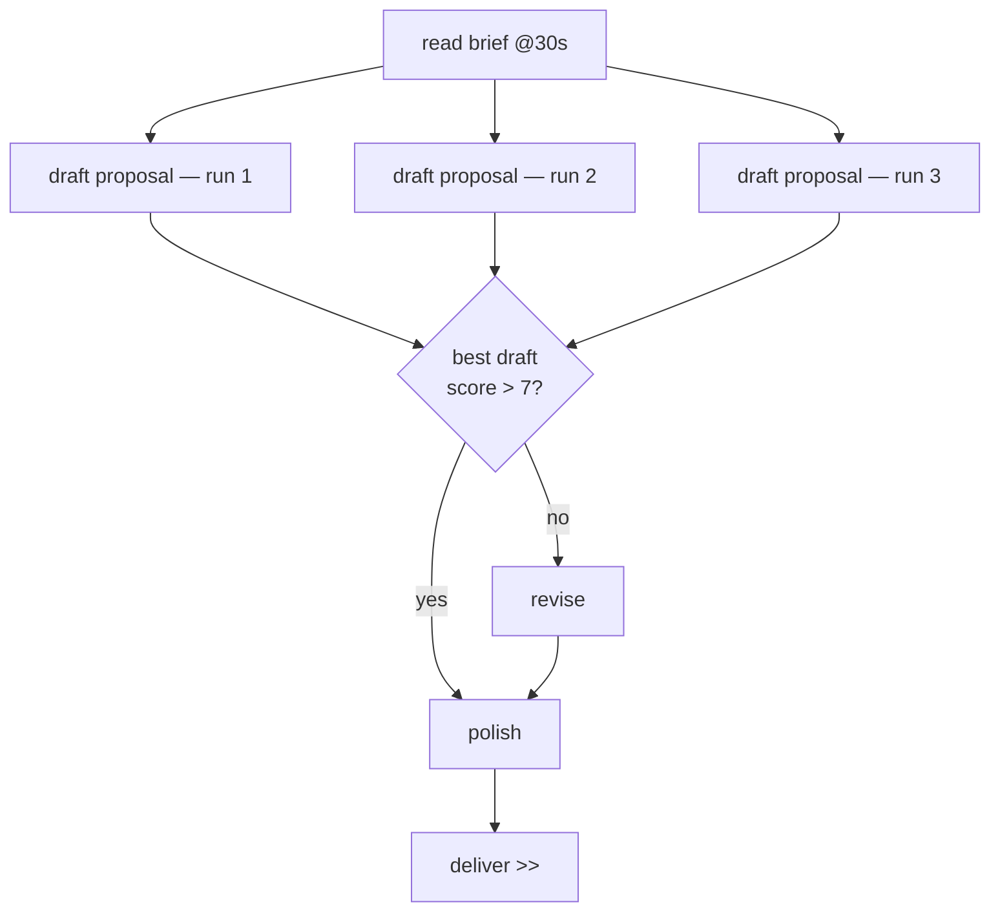
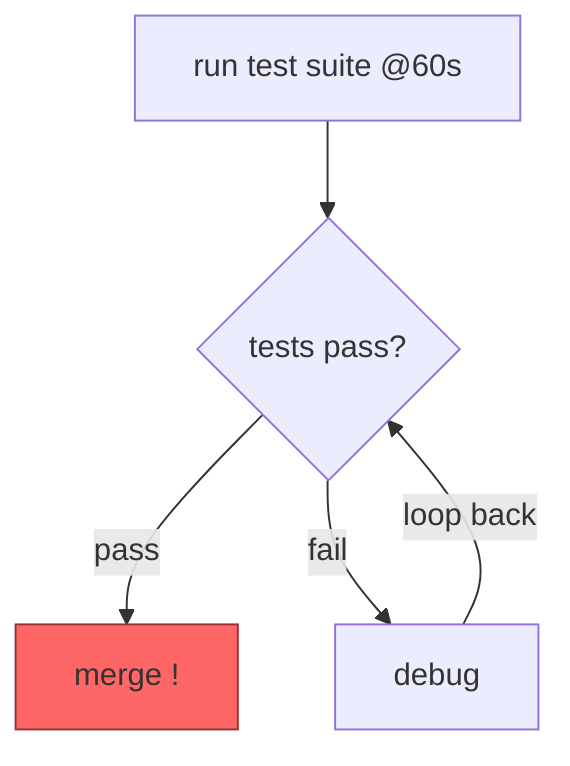
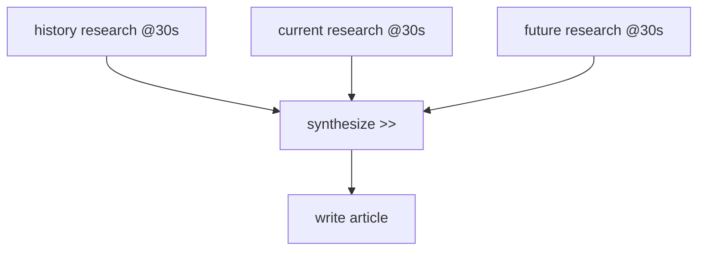
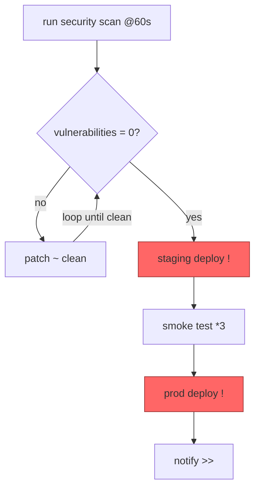
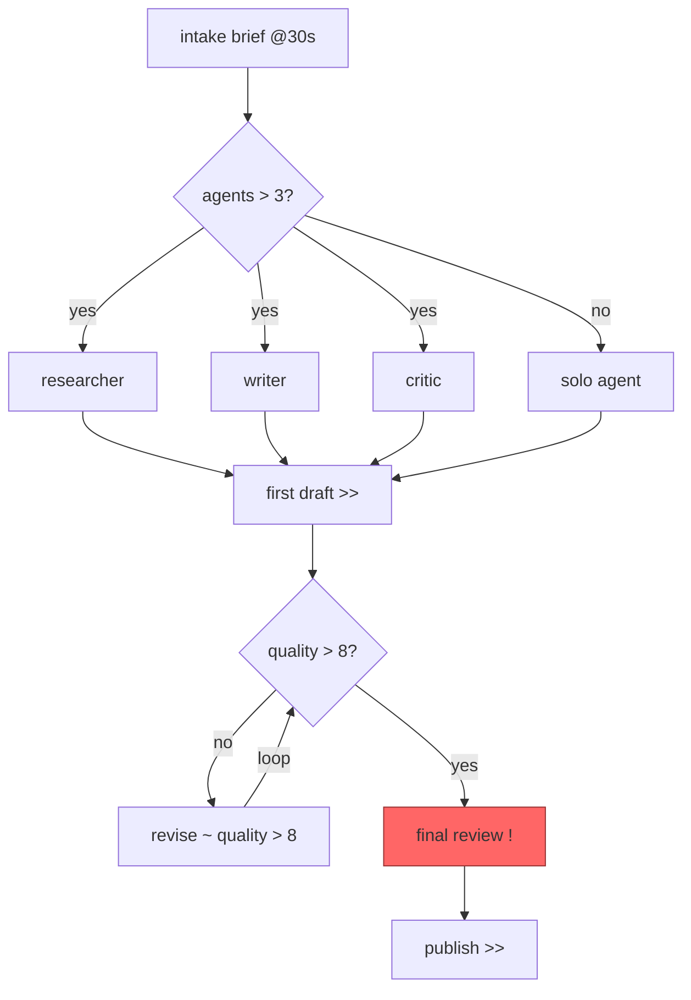

# Graph Notation — Examples

Progressive examples from simple to complex.
Each example shows: the notation, the Mermaid diagram it produces, and what actually runs.

---

## 1. Linear pipeline (no operators)

The simplest possible plan — steps run one after another.

```
1. read the codebase
2. summarize architecture
3. write report
```



**What runs:** three grok calls in sequence. Output of each feeds into the next.

---

## 2. Timeout — `@Ns`

Adds a hard time limit to any step. Useful for tasks that might hang.

```
1. scrape competitor sites @120s
2. extract pricing data
3. write comparison
```



**What runs:** step 1 is killed after 120 seconds if not done. Step 2 gets whatever was collected.

---

## 3. Branch — `|`

A condition line ending in `?` with two routes separated by `|`.

```
1. analyze PR
2. size > 300 lines? | small
3. split into chunks *3
4. review
```



**What runs:** grok analyzes the PR, a routing call checks the condition, then one of the two branches fires.

---

## 4. Parallel — `&`

Steps on the same line joined by `&` run at the same time.

```
1. build project @90s
2. run tests & run linter & check types
3. all passed? | fix *2
4. deploy >>
```



**What runs:** three grok instances spawn simultaneously after the build. They converge at the condition check.

---

## 5. Repeat — `*N`

Runs the same step N times independently. Useful for getting multiple takes.

```
1. read brief @30s
2. draft proposal *3
3. best draft? score > 7 | revise
4. polish
5. deliver >>
```



**What runs:** three independent drafts are generated, then a verifier picks the best one.

---

## 6. Loop — `~ condition`

Keeps repeating until a condition is met. Max 5 iterations by default.

```
1. run test suite @60s
2. tests pass? ~ pass | debug
3. debug ~ pass
4. merge !
```



**What runs:** grok runs tests, verifier checks pass/fail, if fail it debugs and loops back to re-run tests. Halts the whole plan on merge failure (`!`).

---

## 7. Merge — `>>`

Collects results from multiple branches or steps into one synthesized output.

```
1. research topic — history @30s
2. research topic — current @30s
3. research topic — future @30s
4. synthesize >>
5. write article
```



**What runs:** three parallel grok research calls, their outputs merged by a synthesis call, then the article is written from the merged context.

---

## 8. Halt — `!`

Marks a step as a hard requirement. The plan stops completely if it fails.

```
1. run security scan @60s
2. vulnerabilities = 0? | patch ~ clean
3. staging deploy !
4. smoke test *3
5. prod deploy !
6. notify >>
```



**What runs:** security scan loops until clean, then each `!` step will abort the entire plan on failure — staging failure prevents prod deploy.

---

## 9. Full orchestration — all operators

```
1. intake brief @30s
2. scope? agents > 3 | solo
3. spawn researcher & spawn writer & spawn critic
4. first draft >>
5. quality > 8? | revise ~ quality > 8
6. final review !
7. publish >>
```



This is a full multi-agent content pipeline: scope check routes to parallel specialist agents or a solo agent, outputs merge, quality loops until threshold, then publishes with a hard gate.

---

## Meta — this repo's own improvement plan

The plan used to generate this file:

```
1. audit current repo @30s
2. examples < 3? | polish only
3. write beginner examples & write advanced examples
4. add walkthrough guide
5. update NOTATION.md >>
```
